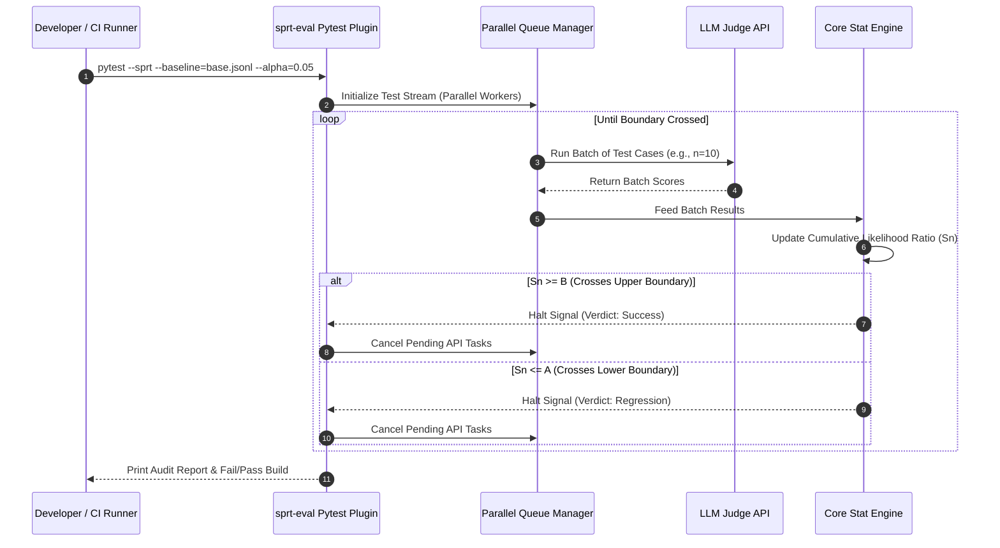

# Technical Implementation Plan: `sprt-eval` (Statistical LLM Evaluation CI Engine)

`sprt-eval` is a developer-first testing framework that applies sequential hypothesis testing to non-deterministic software. By implementing Wald's Sequential Probability Ratio Test (SPRT), it dynamically stops evaluation runs in CI/CD pipelines as soon as a performance change is statistically proven, saving up to 80% on compute and LLM API costs.

---

## 1. Executive Vision: The "What" & "Why"

### What is `sprt-eval`?
`sprt-eval` is a command-line interface (CLI) and a pytest plugin. It sits in a developer’s local workspace or CI/CD runner and acts as a **compute governor for stochastic evaluations**. It evaluates streamed test cases sequentially, calculating whether the candidate model/prompt has regressed or improved compared to a baseline, and aborts the run early once significance thresholds are crossed.

### Why is it Required? (The Point-Estimate Fallacy)
Traditional software testing relies on deterministic assertions (`assert equals`). LLM and agent behaviors are inherently non-deterministic. Currently, AI developers try to evaluate prompt changes by running fixed-size batches (e.g., 200 or 500 test cases) on every commit, using frontier models as judges. This results in:
1.  **Exorbitant API Costs & Latency:** Running 500 test cases with complex agent loops can take 15 minutes and cost $30 in token usage.
2.  **False Confidence:** Developers deploy changes based on raw point-estimate improvements (e.g., accuracy went from 81% to 83% on a small validation set) that are actually statistical noise.
3.  **Wasted Compute:** If a change introduces a catastrophic parsing regression, standard pipelines still run all 500 cases to the end.

`sprt-eval` solves this by applying sequential analysis: if a regression is severe, the engine halts the pipeline after 15 runs, fails the build, and alerts the developer, preventing 97% of the redundant API spend.

---

## 2. Statistical & Mathematical Foundations

### Component 1: Wald's SPRT Formulation
The engine tests the null hypothesis $H_0: \theta = \theta_0$ (baseline performance) against the alternative hypothesis $H_1: \theta = \theta_1$ (target performance/regression). 
We define the target Type I error rate (false positive) as $\alpha$ and Type II error rate (false negative) as $\beta$.

The decision boundaries are defined as:
$$A = \ln \frac{\beta}{1 - \alpha}$$
$$B = \ln \frac{1 - \beta}{\alpha}$$

After observing $n$ test outcomes $x_1, x_2, \dots, x_n$, the cumulative log-likelihood ratio $S_n$ is computed:
$$S_n = \sum_{i=1}^n \ln \frac{f(x_i | \theta_1)}{f(x_i | \theta_0)}$$

*   If $S_n \ge B$: Terminate testing, reject $H_0$, and declare the candidate model statistically superior/different.
*   If $S_n \le A$: Terminate testing, accept $H_0$, and declare a regression (or fail to prove improvement).
*   If $A < S_n < B$: Continue testing, draw the next sample batch.

```
Log-Likelihood Ratio (Sn)
   ▲
 B ┼───────────────────► Accept H1 (Declare Upgrade)
   │     /\  /\
   │    /  \/  \
 0 ┼───/────────\──────► Continue Testing
   │  /
 A ┼─/─────────────────► Accept H0 (Declare Regression / Stop)
   └───────────────────► Number of Samples (n)
```

### Component 2: Distribution Models to Support
1.  **Binomial Model (Pass/Fail):** For binary evaluation outcomes (e.g., assertions, schema compliance, regex matches).
    $$f(x_i | \theta) = \theta^{x_i} (1 - \theta)^{1 - x_i}$$
2.  **Normal Model (Scores/Grades):** For continuous ratings (e.g., LLM-as-a-judge score cards on a 0-1 scale).
    $$f(x_i | \mu, \sigma^2) = \frac{1}{\sigma \sqrt{2\pi}} e^{-\frac{(x_i - \mu)^2}{2\sigma^2}}$$

### Component 3: Overshoot Corrections
In discrete sequential steps, the score $S_n$ will overshoot the boundaries $A$ or $B$. We will research and implement Siegmund’s correction to adjust boundary thresholds dynamically, preventing inflation of the nominal Type I/II error rates.

---

## 3. System Architecture & Key Components



---

## 4. Proposed Folder Layout & Code Blueprints

```
sprt-eval/
├── core/
│   ├── __init__.py
│   ├── stats.py         # Wald's SPRT mathematical engine
│   └── runner.py        # Stream collector and batch worker
├── judges/
│   ├── __init__.py
│   └── judge.py         # LLM evaluation connector and calibrator
├── pytest_plugin/
│   └── plugin.py        # Pytest test execution hooks
└── tests/
    └── test_stats.py
```

### [NEW] [stats.py](file:///E:/CODE_TOP/Project/sprt_eval/core/stats.py)
*   Computes the sequential likelihood ratios.
*   Calculates bootstrap confidence intervals using the percentile or BCa method upon execution halt.

```python
# stats.py
import numpy as np

class SPRTBinomial:
    def __init__(self, p0, p1, alpha=0.05, beta=0.10):
        self.p0 = p0
        self.p1 = p1
        self.a = np.log(beta / (1 - alpha))
        self.b = np.log((1 - beta) / alpha)
        self.log_ratio_success = np.log(p1 / p0)
        self.log_ratio_failure = np.log((1 - p1) / (1 - p0))
        self.cumulative_score = 0.0
        
    def update(self, success_count, total_count):
        failures = total_count - success_count
        step_score = (success_count * self.log_ratio_success) + (failures * self.log_ratio_failure)
        self.cumulative_score += step_score
        
        if self.cumulative_score >= self.b:
            return "UPGRADE"
        elif self.cumulative_score <= self.a:
            return "REGRESSION"
        return "CONTINUE"
```

### [NEW] [runner.py](file:///E:/CODE_TOP/Project/sprt_eval/core/runner.py)
*   Orchestrates concurrent worker pools (`ThreadPoolExecutor` or `asyncio`).
*   Streams evaluations, executes evaluations in mini-batches, checks boundaries, and cancels remaining queue items upon receiving a halt signal.

### [NEW] [judge.py](file:///E:/CODE_TOP/Project/sprt_eval/judges/judge.py)
*   Maintains connectors to OpenAI/Anthropic/Ollama judges.
*   Implements **Conformal Prediction wrappers** to output calibrated certainty ratings for LLM judge scores.

### [NEW] [plugin.py](file:///E:/CODE_TOP/Project/sprt_eval/pytest_plugin/plugin.py)
*   Intercepts pytest collections using `pytest_runtestloop`.
*   Implements a custom loop that schedules test runs based on SPRT stream state rather than executing tests sequentially to completion.

---

## 5. Construction Steps

### Phase 1: Mathematical Engine & Bootstrap CI (Weeks 1-3)
*   **Goal:** Build and verify the statistical core.
*   **Steps:**
    1.  Implement binomial and normal SPRT logic inside `stats.py`.
    2.  Write the BCa (Bias-Corrected and Accelerated) bootstrap confidence interval calculator to compute accuracy boundaries at halt.
    3.  Create extensive unit tests simulating random walks to verify that the empirical Type I error rates match targets ($\alpha$).

### Phase 2: Pytest Plugin Integration & Batching (Weeks 4-6)
*   **Goal:** Allow users to wrap tests with SPRT early stopping.
*   **Steps:**
    1.  Build the pytest hook extensions in `plugin.py`.
    2.  Implement the concurrent queue worker in `runner.py`.
    3.  Support `@pytest.mark.sprt` markers, allowing developers to define $\alpha$, $\beta$, and baseline accuracy targets directly on test cases.

### Phase 3: Judge Calibration Engine (Weeks 7-9)
*   **Goal:** Build guardrails around LLM-as-a-judge non-determinism.
*   **Steps:**
    1.  Implement `judge.py` to evaluate agreement between the LLM judge and a small, human-labeled golden validation set.
    2.  Apply Conformal Prediction to establish uncertainty intervals for LLM grades. If a judge score is within the conformal uncertainty boundary, label the test case outcome as "ambiguous" (which down-weights its impact on the cumulative SPRT score).

### Phase 4: CLI Interface & CI Gate (Weeks 10-12)
*   **Goal:** Build the command-line entry point.
*   **Steps:**
    1.  Build the CLI parser (`sprt-eval run --baseline=x.jsonl --candidate=y.jsonl`).
    2.  Produce beautiful, clean terminal output summarizing:
        *   The stopping sample number.
        *   Token and API cost savings percentage.
        *   Final confidence intervals.
    3.  Configure exits code (`0` for success/no regression, `1` for proven regression) to support native GitHub Actions integration.

---

## 6. Verification Plan

### Automated Simulation Tests
We will verify the statistical guarantees of `sprt-eval` using synthetic runs:
1.  **Wald boundary validation:**
    *   Simulate a candidate model with a true accuracy of 70% against a baseline of 80% (regression).
    *   Assert that `sprt-eval` stops the evaluation early and outputs a "REGRESSION" verdict.
    *   Measure and verify that the average sample path length (ASN) is reduced by at least 60% compared to a fixed run of 500.
2.  **Concurrency checks:**
    *   Verify that if the halt boundary is crossed on sample 20 of a 500-sample queue, all async workers scheduled for samples 21–500 are cancelled immediately, preventing network payload executions.

### Manual Verification
1.  **CI/CD Pipeline Run:**
    *   Create a demo repository using GitHub Actions.
    *   Add a test step using `sprt-eval`. Introduce a bug in the prompt helper logic.
    *   Verify that the GitHub Action terminates the test execution early, displays the statistics on the runner terminal, and exits with code `1`, blocking the pull request.
